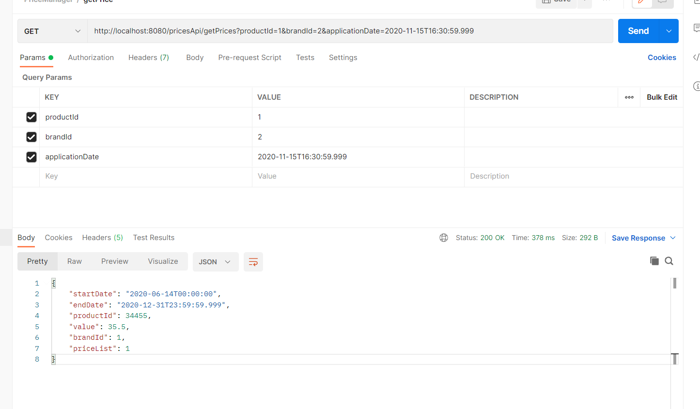

# PricesManager
Sistema de precios y tarifas según las fechas dadas.

##### Para poder utilizar este sistema usted debe copiar el proyecto, por ejemplo , {system.user}/Desktop/ luego hacer "cd  {system.user}/Desktop/PricesManager", ejecutar el comando de construcción de maven.
##### En PricesManager/target obtendrá PricesManager.jar el cual puede copiar en otro lugar o allí mismo ejecutar java -jar PricesManager.jar, también puede ejecutarlo con $ docker run.

## Prueba en postman.

#### ENDPOINT
#### http://localhost:8080/pricesApi/getPrices?productId=1&brandId=2&applicationDate=2020-11-15T16:30:59.999